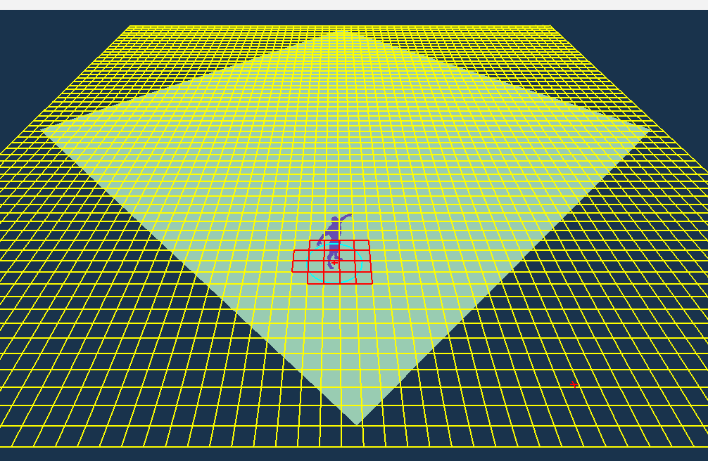

# **自作3Dゲームエンジン**

## **2025/05/09**

## **基本機能**

### **ゲーム基盤**

#### **描画空間(3D)と論理(2D)の連携**(Linking Drawing Space (3D) and Logical (2D))
* 3Dモデルをインポートし，その`Transform(描画用)情報(3D)`から`論理情報(2D)`を自動初期化する機能
    * 見た目をもとにゲーム用ロジックを整合的に自動初期化できる

#### **コリジョン検出**(Collision Detection)
* 3Dモデルをインポートし，その`最大軸`or`最小軸`を選択し，円形の`2Dコリジョン形状`を自動作成する機能
* `BaseTerrainMesh`となる3Dモデルをインポートし，それを完全に覆う`2D論理タイルマップ`を自動作成する機能
* `2D論理タイルマップ`と(プレイヤー)キャラクターの`2Dコリジョン形状`の重なりを検出し，`Debug用の描画`を実行する機能

==============

### **ゲーム操作(入出力)**
* マウスポインタのウィンドウ上の座標から`論理空間の位置`を計算し，**view行列／projection行列**を考慮して描画する機能
* マウスポインタの位置の方向へキャラクターの`Frontベクトル`を回転させる機能
* 

## **イメージ**
